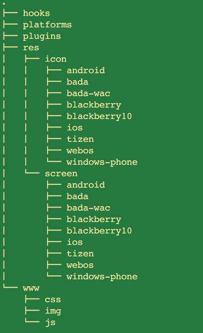

## <span class="mysql-color">Installing the Cordova CLI</span>

The Cordova command-line tool is distributed as an npm package.

 - Download and install Node.js
 - Download and install Cordova


---

## <span class="mysql-color">Create Hello World APP</span>

 - Go to the directory where you maintain your source code.

```
cordova create hello com.example.hello HelloWorld
```
The __create__ script generates a skeletal web-based application whose home page is the project's www/index.html file.

---

## <span class="mysql-color">Directory Structure</span>



---

## <span class="mysql-color">Config & Www</span>

 - config.xml
  - __Configures your application__ and allows you to customize the behavior
 - www/
  - Contains the __project's web artifacts__, such as .html, .css and .js files.
  - They will be copied on a __cordova prepare__ to each platform's www directory.

---

## <span class="mysql-color">Platforms & Plugins</span>

 - platforms/
   - Contains all the __source code and build scripts__ for the platforms that you add to your project.
   - You should __not edit any files__ in the /platforms/ directory unless you know what you are doing.
 - plugins/
   - Any added plugins will be __extracted or copied__ into this directory.

---

## <span class="mysql-color">Hooks & Merges</span>

 - hooks/
   - Contains scripts __used to customize cordova-cli__ commands.
 - merges/
   - __Platform-specific web assets__ (HTML, CSS and JavaScript files) are contained within appropriate subfolders in this directory.
   - Files placed under merges/ will __override matching files__ in the www/
   -  These are deployed during a __prepare__ to the appropriate native directory
